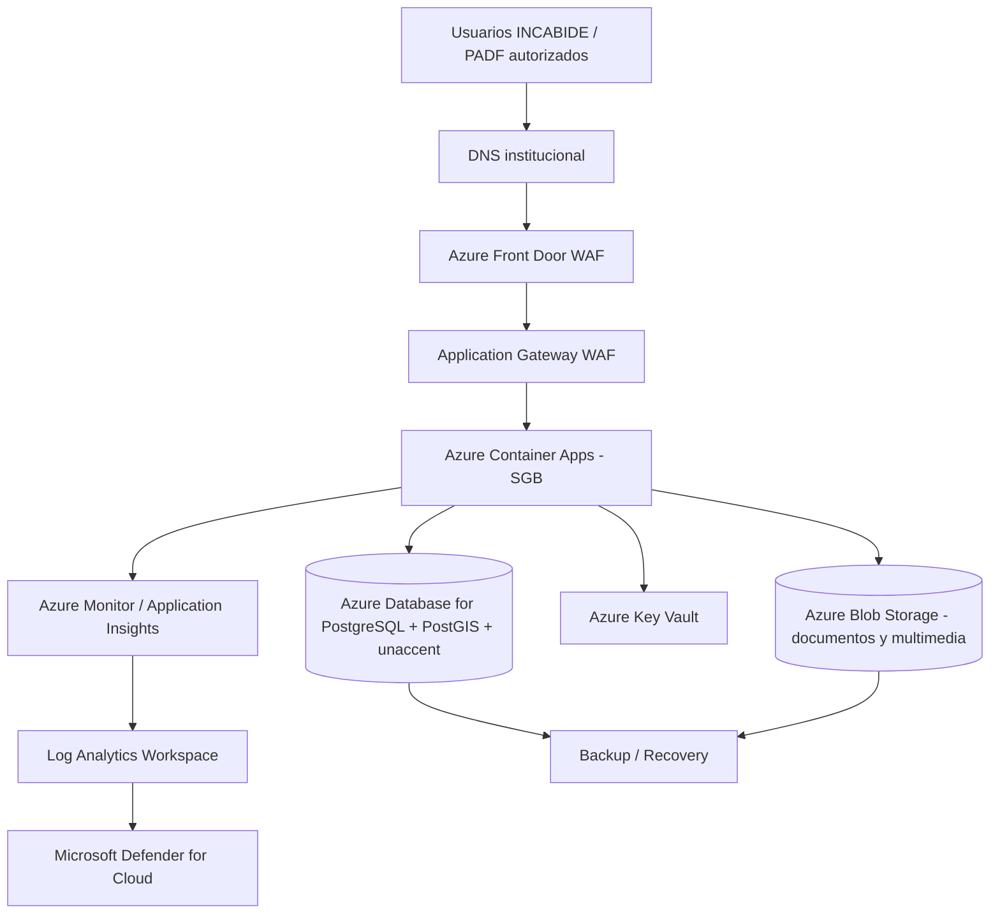
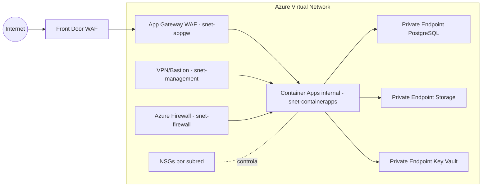
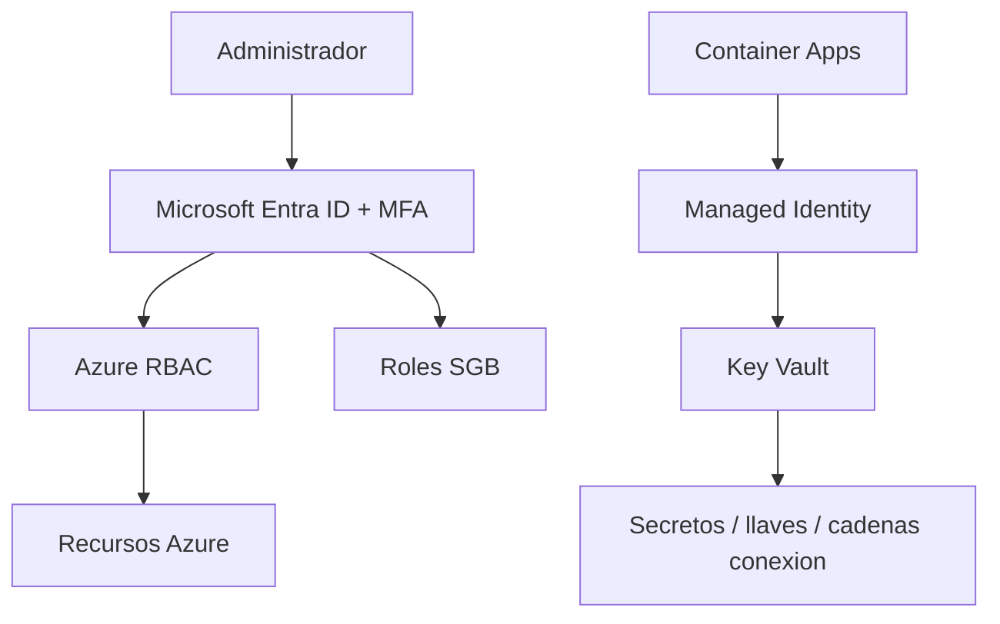
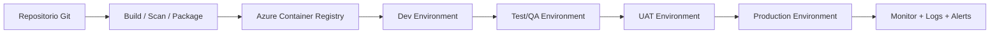
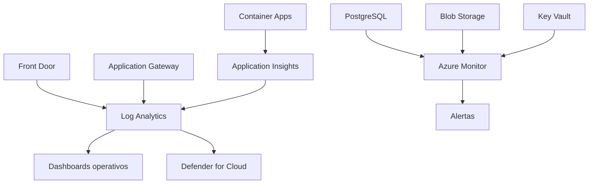
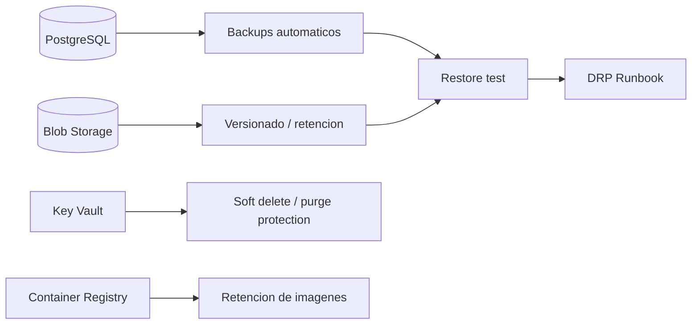
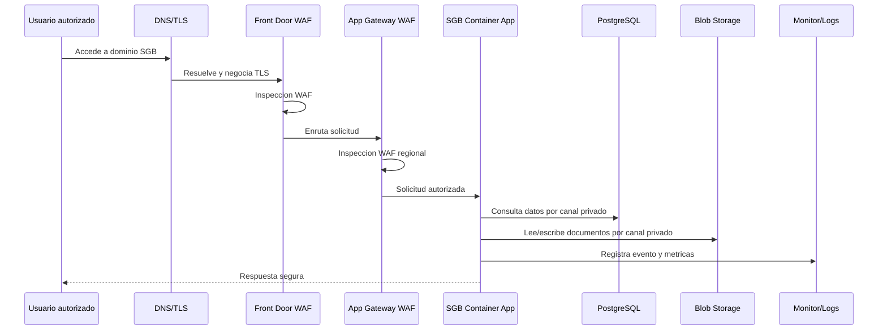

# 26 — AZURE ARCHITECTURE DIAGRAMS

## Objetivo

Proveer diagramas tecnicos en Mermaid listos para incorporarse en la propuesta o convertirse posteriormente en diagramas visuales. No son despliegues ni IaC.

## Diagrama 1 — Arquitectura general

## Diagrama 2 — Red y seguridad

## Diagrama 3 — Identidad y secretos

## Diagrama 4 — Dev / Test / Prod

## Diagrama 5 — Observabilidad

## Diagrama 6 — Backup y recuperacion

## Diagrama 7 — Flujo de solicitud segura

## Notas

- Los diagramas son proposal-ready, no IaC.
- La topologia final depende de validacion de region, tenant, ambientes, WAF, DDoS y RTO/RPO.
