# 21 — PROJECT EXECUTION MODEL

## 21.1 Enfoque de ejecucion

Justech propone un modelo de ejecucion propio para el proyecto SGB de INCABIDE, construido sobre buenas practicas de direccion de proyectos, entrega agil, DevSecOps e IT Service Management. El modelo no se presenta como un estandar certificado; se presenta como un marco operativo adaptado a la RFP, orientado a control de alcance, calidad, seguridad, evidencia y aceptacion por hitos.

El modelo combina:

- gobierno de proyecto y gestion de riesgos inspirados en PMI;
- ejecucion incremental y validacion frecuente inspirada en practicas Agile;
- seguridad y automatizacion desde el ciclo de entrega, bajo enfoque DevSecOps;
- soporte, incidentes, cambios y continuidad alineados con buenas practicas ITIL.

## 21.2 Diagrama del ciclo de vida

```mermaid
flowchart LR
  A[Inicio] --> B[Descubrimiento]
  B --> C[Arquitectura]
  C --> D[Configuracion]
  D --> E[Desarrollo / Adaptacion]
  E --> F[Integraciones]
  F --> G[Migracion / Datos]
  G --> H[QA]
  H --> I[UAT]
  I --> J[Capacitacion]
  J --> K[Go Live]
  K --> L[Hypercare]
  L --> M[Cierre]
```

## 21.3 Fases de ejecucion

| Fase | Objetivo | Entradas | Actividades | Entregables | Roles | Riesgos | Controles | Criterios de salida |
| --- | --- | --- | --- | --- | --- | --- | --- | --- |
| Inicio del proyecto | Formalizar gobierno, alcance operativo y canales. | RFP, contrato, equipo, stakeholders. | Kickoff, RACI, calendario, riesgos iniciales, matriz de decisiones. | Acta kickoff, RACI, plan de gobierno. | Project Director, PADF/INCABIDE, lideres tecnicos. | Alineacion incompleta. | Minuta, decisiones, responsables. | Gobierno aprobado y responsables confirmados. |
| Descubrimiento | Entender codigo, procesos, datos y dependencias reales. | Codigo fuente, anexos, usuarios clave, documentos tecnicos. | Revision funcional/tecnica, inventario, brechas, preguntas. | Informe de diagnostico, backlog validado. | Technical Delivery, Azure Architect, QA, Funcional. | Codigo mas complejo de lo previsto. | Registro de hallazgos y riesgos. | Diagnostico validado y acciones priorizadas. |
| Arquitectura | Definir diseno objetivo de solucion y Azure. | RFP, diagnostico, decisiones pendientes. | Arquitectura logica, fisica, datos, seguridad, redes, DR. | Documento arquitectura implementable. | Azure Architect, Technical Lead, DevOps, Security. | Decisiones Azure no cerradas. | Decision log, revision tecnica. | Arquitectura aprobada para configuracion. |
| Configuracion | Preparar ambientes, parametros y bases de seguridad. | Arquitectura, accesos, tenant/suscripcion, DNS. | Configurar ambientes, redes, secretos, repositorios, monitoreo base. | Ambientes DEV/TEST/UAT/PROD segun alcance aprobado. | DevOps, Azure Architect. | Accesos incompletos. | Checklist configuracion. | Ambientes listos y validados. |
| Desarrollo / Adaptacion | Adaptar SGB existente y preparar evoluciones. | Codigo, diagnostico, backlog. | Refactor cloud, dependencias, branding, terminologia, ajustes funcionales. | Codigo adaptado, artefactos versionados. | Technical Delivery, DevOps, QA. | Deuda tecnica oculta. | Code review, escaneos, pruebas. | Build y pruebas iniciales exitosas. |
| Integraciones | Definir y construir integraciones aprobadas. | API scope, sistemas externos, credenciales. | API SGB, integracion subastas si aplica, conectores aprobados. | API documentada, pruebas integracion. | Azure Architect, Technical Lead, DevOps. | PGR/subasta sin especificacion. | Separacion API base vs externos. | Integracion validada o dependencia documentada. |
| Migracion | Preparar datos, catalogos e importaciones si aplica. | Fuentes, catalogos, archivos, reglas. | Perfilamiento, mapeo, carga prueba, reconciliacion. | Plan/carga de migracion validada. | Data/Technical Lead, QA, Funcional. | Datos incompletos. | Reporte de errores y aprobacion. | Datos validados por usuarios clave. |
| QA | Validar funcionalidad, seguridad, permisos y no conformidad. | Casos prueba, requisitos, ambiente QA. | Pruebas funcionales, tecnicas, seguridad, regresion. | Reportes QA, matriz requisito-prueba-evidencia. | QA Lead, Technical Lead, DevOps. | Aprobacion por prueba aislada. | Criterio de no conformidad. | Sin defectos bloqueantes y evidencias completas. |
| UAT | Obtener validacion de INCABIDE/PADF. | Version candidata, casos UAT, usuarios. | Ejecucion UAT, defectos, revalidacion, actas. | Acta UAT, lista de pendientes. | QA Lead, usuarios INCABIDE, Project Director. | Usuarios no disponibles. | Sesiones guiadas y actas. | UAT aprobado o pendientes aceptados. |
| Capacitacion | Transferir conocimiento tecnico y funcional. | Manuales, runbooks, version estable. | Sesiones, practicas, Q&A, asistencia. | Materiales, grabacion/PDF, lista asistencia. | Training/QA/Technical Lead. | Baja adopcion. | Evaluacion y confirmacion. | INCABIDE confirma autonomia requerida. |
| Go Live | Poner en produccion controladamente. | UAT aprobado, checklist, accesos, backup. | Release, validaciones, monitoreo, comunicacion. | Acta Go Live, evidencias produccion. | Project Director, DevOps, Azure Architect, QA. | Incidencia productiva. | Plan rollback, health checks. | Produccion estable y monitoreada. |
| Hypercare | Acompanamiento intensivo post-Go Live. | Produccion, tickets, monitoreo. | Soporte, estabilizacion, seguimiento, ajustes menores aprobados. | Reporte hypercare, incidentes cerrados. | Support, DevOps, QA, Project Director. | Incidentes recurrentes. | SLA, RCA, escalamiento. | Incidentes criticos cerrados y operacion estable. |
| Cierre | Formalizar aceptacion y transferencia final. | Entregables, evidencias, actas. | Validacion final, documentacion, credenciales, lecciones. | Acta cierre, paquete final. | Project Director, PADF/INCABIDE. | Evidencias incompletas. | Checklist cierre. | Acta de cierre firmada. |

## 21.4 Matriz de entregables

| Fase | Entregables principales | Evidencia |
| --- | --- | --- |
| Inicio | Acta kickoff, RACI, plan de gobierno | Minuta y aprobacion |
| Descubrimiento | Informe diagnostico, inventario dependencias | Documento tecnico |
| Arquitectura | Arquitectura Azure, seguridad, datos, integracion | Diagramas y decision log |
| Configuracion | Ambientes y controles base | Checklist y capturas |
| Desarrollo / Adaptacion | Codigo adaptado, branding, terminologia | Repositorio y pruebas |
| Integraciones | API SGB, pruebas integracion | Especificacion y evidencias |
| Migracion | Plan de migracion/carga, reporte errores | Matriz de mapeo |
| QA | Reportes QA, defectos, trazabilidad | Matriz requisito-prueba |
| UAT | Acta UAT | Firma o aprobacion escrita |
| Capacitacion | Materiales, lista asistencia | PDF/grabacion/lista |
| Go Live | Acta Go Live, checklist produccion | Evidencias operativas |
| Hypercare | Reporte soporte inicial | Tickets y RCA si aplica |
| Cierre | Acta cierre final | Paquete de cierre |

## 21.5 Matriz de aprobaciones

| Entregable | Aprobador principal | Aprobador tecnico/funcional | Condicion de aprobacion |
| --- | --- | --- | --- |
| Diagnostico de codigo | PADF/INCABIDE | Lider tecnico INCABIDE | Informe completo y prueba de ejecucion |
| Arquitectura Azure | INCABIDE TI / PADF | Azure Architect | Componentes, seguridad, decisiones pendientes |
| Branding/terminologia | INCABIDE | Area legal/comunicacion | Cero referencias foraneas no aprobadas |
| Puesta en produccion | PADF/INCABIDE | DevOps/Seguridad INCABIDE | TLS, API, modulos originales, evidencias seguridad |
| Documentacion tecnica | INCABIDE TI | Tecnico no involucrado | Puede ejecutar procedimientos |
| Capacitacion | INCABIDE | Coordinador TI | Asistencia y autonomia confirmada |
| Modulo Etapa II | PADF/INCABIDE | Coordinador TI / usuario clave | UAT, manual, codigo y acta parcial |

## 21.6 Matriz de riesgos

| Riesgo | Impacto | Mitigacion |
| --- | --- | --- |
| Codigo fuente con deuda tecnica no visible | Retrabajo y atraso | Diagnostico temprano y registro de hallazgos |
| Decisiones Azure pendientes | Costos o diseno incompleto | Decision log y supuestos aprobados |
| API/PGR ambiguo | Sobrealcance | Separar API base de PGR opcional |
| UAT sin usuarios disponibles | Retraso aceptacion | Agenda y responsables desde inicio |
| Seguridad insuficiente | Penalidades y rechazo | Controles RFP, escaneos, pentest, evidencias |
| Datos no definidos | Migracion incompleta | Estrategia condicionada e inventario |

## 21.7 Modelo de seguimiento ejecutivo

El seguimiento ejecutivo se estructura en reportes breves orientados a decisiones:

- avance por fase;
- estado de entregables;
- riesgos criticos;
- decisiones pendientes;
- bloqueos;
- acciones correctivas;
- evidencias completadas;
- proximos hitos.

## 21.8 Modelo de escalamiento

| Nivel | Responsable | Criterios de escalamiento |
| --- | --- | --- |
| Operativo | Lider tecnico / QA / DevOps | Defectos, dudas funcionales, bloqueos menores |
| Tecnico | Azure Architect / Technical Delivery Lead | Arquitectura, integraciones, seguridad, datos |
| Ejecutivo | Project Director | Riesgos de plazo, alcance, aceptacion, relacion PADF/INCABIDE |
| Comite | PADF/INCABIDE + Direccion Justech | Decisiones contractuales, prioridades, cambios mayores |

## 21.9 Modelo de gestion de cambios

Todo cambio debe registrar:

- origen;
- descripcion;
- requisito afectado;
- impacto tecnico;
- impacto en seguridad;
- impacto en cronograma;
- impacto economico, si aplica en documento separado;
- aprobador;
- decision;
- evidencia.

Ningun cambio critico debe implementarse sin aprobacion y trazabilidad.
