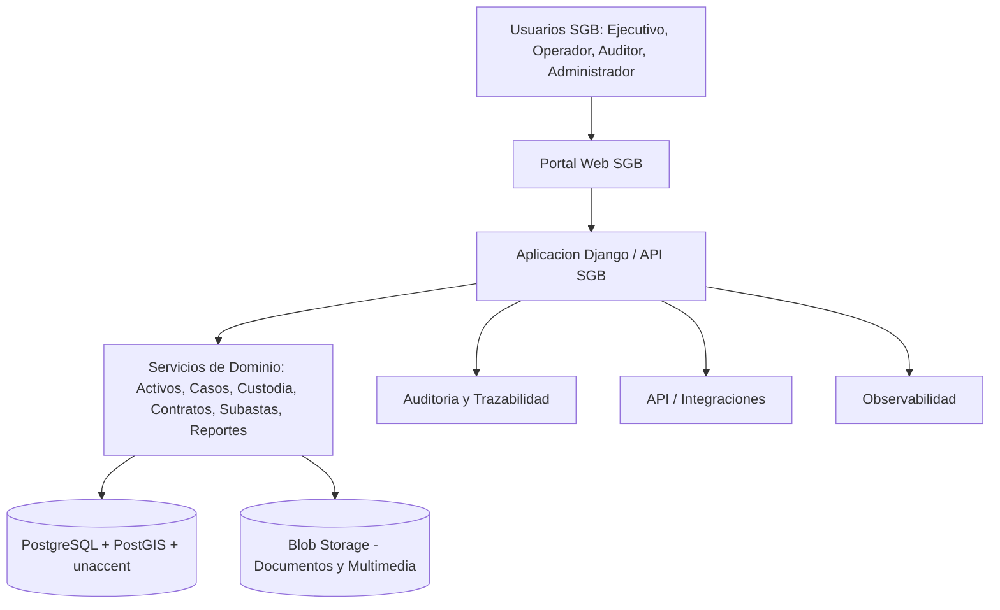
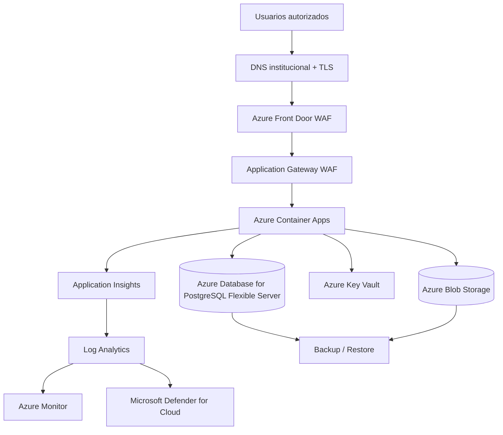
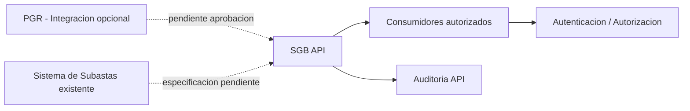
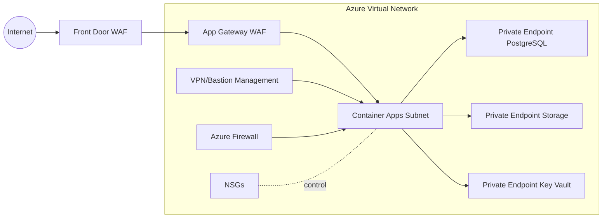

# 22 — DEFINITIVE TECHNICAL ARCHITECTURE

## 22.1 Vision de arquitectura

La arquitectura tecnica definitiva del SGB se disena como una plataforma Enterprise sobre Microsoft Azure, orientada a operar de forma segura, escalable, monitoreada y gobernada. La arquitectura responde a los requisitos de la RFP: contenedores, PostgreSQL 14+ con PostGIS y unaccent, almacenamiento de medios, seguridad reforzada, auditoria, backups, DRP, VPN, WAF, MFA, RBAC y monitoreo.

## 22.2 Arquitectura logica

## 22.3 Arquitectura fisica Azure

## 22.4 Arquitectura de seguridad

La seguridad se implementa en capas:

| Capa | Controles |
| --- | --- |
| Identidad | Microsoft Entra ID, MFA, RBAC, minimo privilegio |
| Perimetro | Azure Front Door WAF, Application Gateway WAF, TLS |
| Red | VNet, subredes, NSG, Azure Firewall, Private Endpoints, VPN/Bastion |
| Aplicacion | Autorizacion por rol, auditoria, validacion, logs |
| Datos | Cifrado en reposo/transito, PostgreSQL privado, Blob Storage privado |
| Secretos | Key Vault, Managed Identity |
| Operacion | Monitor, Log Analytics, Defender, alertas, pentest |

## 22.5 Arquitectura de integracion

La API del SGB se define como capacidad obligatoria para INCABIDE. La integracion PGR se mantiene separada porque la RFP indica que depende de aprobacion de dicha institucion y debe cotizarse como item independiente.

## 22.6 Arquitectura de datos

| Dominio | Almacenamiento | Consideraciones |
| --- | --- | --- |
| Datos transaccionales | PostgreSQL Flexible Server | Integridad, auditoria, PostGIS, unaccent |
| Geolocalizacion | PostgreSQL/PostGIS | Provincias, municipios, coordenadas o referencias |
| Documentos y multimedia | Blob Storage | Metadatos, confidencialidad, permisos |
| Auditoria | Base SGB + Log Analytics | Accesos, cambios, exportaciones, eventos |
| Reportes | PostgreSQL + vistas/reporting | Exportacion controlada |

## 22.7 Arquitectura de aplicaciones

La aplicacion se ejecuta como contenedor, preferiblemente en Azure Container Apps, sujeto a validacion PADF/INCABIDE. Alternativas consideradas:

| Plataforma | Ventaja | Riesgo |
| --- | --- | --- |
| Azure Container Apps | Gestionada, escalable, adecuada para contenedores | Requiere validacion si PADF exige VM literal |
| Azure App Service for Containers | Gestionado y simple | Menor control de red en escenarios avanzados |
| AKS | Maximo control y orquestacion | Mayor complejidad operativa |
| VM Docker | Lectura literal de VM/Docker | Mayor carga de administracion y hardening |

## 22.8 Arquitectura de red

## 22.9 Topologia recomendada

- VNet dedicada por entorno o segmentacion por subredes segun decision.
- Subred para Application Gateway.
- Subred para plataforma de contenedores.
- Subred para Private Endpoints.
- Subred de administracion.
- Subred de Azure Firewall.
- Private DNS Zones para resolucion privada.

## 22.10 Dimensionamiento recomendado

El dimensionamiento final depende de usuarios, concurrencia, volumen de datos, volumen multimedia y RTO/RPO. Para propuesta tecnica se recomienda:

| Capa | Recomendacion sin precios |
| --- | --- |
| Aplicacion | Definir replicas minimas y maximas por ambiente; escalar por CPU/memoria/requests |
| Base de datos | Flexible Server con capacidad ajustable; HA sujeto a validacion |
| Storage | Blob Storage con redundancia segun criticidad |
| Logs | Retencion segun auditoria y soporte |
| Seguridad | WAF, Key Vault, Defender y Private Endpoints segun alcance aprobado |

## 22.11 Ambientes DEV / TEST / UAT / PROD

| Ambiente | Uso |
| --- | --- |
| DEV | Adaptacion, desarrollo y pruebas internas |
| TEST | Integracion tecnica y QA |
| UAT | Validacion PADF/INCABIDE |
| PROD | Operacion institucional |

Cantidad final y permanencia: `PENDIENTE DE VALIDACION`.

## 22.12 Alta disponibilidad y escalabilidad

- Entrada con servicios WAF gestionados.
- Aplicacion con multiples replicas.
- Base de datos con HA si se aprueba.
- Storage con redundancia.
- Monitorizacion y alertas.
- Escalado por demanda y por crecimiento modular.

## 22.13 Backup y Disaster Recovery

| Recurso | Estrategia |
| --- | --- |
| PostgreSQL | Backups automaticos, restore test, retencion definida |
| Blob Storage | Versionado/retencion/redundancia |
| Key Vault | Soft delete y proteccion contra purga recomendada |
| ACR | Imagenes versionadas |
| Configuracion | Git/documentacion sin secretos |

RTO/RPO: `PENDIENTE DE VALIDACION`.

## 22.14 Gobierno

- Naming convention.
- Resource groups por ambiente.
- Tags obligatorios.
- Azure Policy.
- RBAC.
- Activity Logs.
- Locks en recursos criticos.
- Presupuesto y alertas de consumo sin precios en propuesta tecnica.

## 22.15 Cost assumptions

No se incluyen precios. Las variables necesarias para estimacion son:

- region;
- ambientes;
- usuarios/concurrencia;
- CPU/memoria/replicas;
- almacenamiento inicial y crecimiento;
- multimedia;
- WAF/DDoS;
- Firewall/VPN/Private Endpoints;
- retencion logs/backups;
- HA/DR;
- Defender plans;
- egress;
- soporte.
